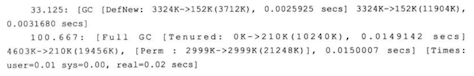
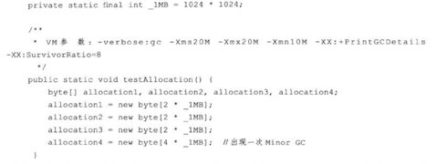

**<u>笔记书籍: 《 深入理解Java虚拟机 》</u>**

### 笔记日期: 2018-07-10一一2018-07-14

##### GC日志的解读



33.125 / 100.667 : GC发生的时间 (虚拟机从启动以来的秒数)

[GC / [Full GC / [Full GC(system) : 这次垃圾收集的停顿类型,如果是Full,那么这次GC中发生了Stop-The-World System.gc

[DefNew  / [Tenured : 表明了发生GC的区域,也可以从中看出来收集器的类型,如DefNew就是使用的Serial收集器

3324k->152k(11904k) : GC前该区域已使用的内存->GC后该区域已使用的内存(内存总容量)

#### 内存分配策略

##### 对象优先在Eden分配,如果内存不够了就进行Minor GC



如果限制Java堆为20M,新生代和老年代都为10M,新生代Eden和Survivor为8:1,那么Eden为8M,程序执行完成之后内存是如何分配的呢?

```
	allocation1先进入到Eden,allocation2进入到Eden,空间还够,allocation3进入到Eden,这时候Eden中已经放了6M了,还剩下2M的空间,allocation4已经放不进去了.那就进行GC吧(进行MinorGC)
	GC的时候发现allocation1-3都是存活的对象并且大小都大于Survivor的1M,所以只好通过担保机制将allocation4放到了老年代
	运行完成之后Eden放了三个2M的对象,老年代放了一个4M的对象,Survivor全是空的
```

注 : MinorGC就是新生代GC,MajorGC/FullGC是老年代GC

##### 大对象直接进入到老年代

所谓的大对象,指的是需要大量连续内存空间的Java对象,比如说很长的字符串以及数组.(虚拟机很不喜欢的就是遇到一群"朝生夕灭"的"大对象",尽量少用这样的对象)

可以通过`-XX:PretenureSizeThreshold`参数设置大于这个大小的对象直接进入到老年代

##### 长期存活的对象进入老年代

虚拟机给每个对象定义了一个对象年龄计数器,对象在Eden中创建并且如果能在survivor中存活,每存活一次它的年龄都+1,当它的年龄大于某个数值的时候 ( 默认是15 ),它就会进入到老年代中.

> 每次GC的时候Eden和其中一个Survivor(称为From)会将还存活的对象复制到To(另一个Survivor)中去,然后直接将Eden和From给清空了,下一次的时候To就会作为From继续此过程.

##### 动态对象年龄判定

如果在Survivor空间中相同年龄所有对象的大小总和大于Survivor空间的一半,年龄大于或等于该年龄的对象就可以直接进入到老年代.

##### 空间分配担保

在发生MinorGC的时候,是需要将Eden(E)+Survivor(A)中存活的对象复制到另一个Survivor(B)中的,那么就有可能B中的空间不够存放E+A,这个时候就需要老年代的空间来担保,担保的意思就是说如果你那里不够放下的话,可以放到我这里来.

那么如果老年代中的连续的空间够E+A的存放,那么这一次GC肯定是可以成功的.

如果老年代中的连续的空间不够了,要去看虚拟机设置的参数`HandlePromotionFailure`了,如果设置的是不允许担保失败,那么只能进行FullGC了.不过如果设置的是允许担保失败,那么虚拟机就会进行一次风险GC.

风险GC是这样执行的,虚拟机会记录之前每次GC的时候进入到老年代中的对象的平均值大小,如果现在老年代中的连续的内存的大小是大于进入到老年代对象的平均值大小的,那么就可以尝试进行一次风险GC.

如果这次风险GC中进入到老年代中对象的大小高于平均值,那么老年代中肯定是放不下的,那么只好进行一次FullGC了,否则这次GC就会成功了.

**但是**:在JDK1.6Update24之后,这个参数已经不再使用了,也就是说如果老年代的连续空间大于新生代空间或者大于历次晋升的平均值,那么就会进行一次MinorGC,否则会进行FullGC

#### 类文件结构

##### 一些基础知识

Java虚拟机不和包括Java在内的任何语言绑定,它只与"Class文件"这种特定的二进制文件格式所关联,而在Class文件中包含了Java虚拟机指令集和符号表以及若干其他的辅助信息.

任何一个Class文件都对应着唯一一个类或者接口的定义信息,但是类或者接口不一定都得定义在文件里(类或者接口也可以通过类加载器直接生成)

无符号数用来描述数字,索引等信息,通过u1,u2,u4,u8来描述.描述的时候经常会使用一个前置的容量计数器加若干个连续的数据项的形式,这时称这一系列连续的某一类型数据为某一类型的集合.

