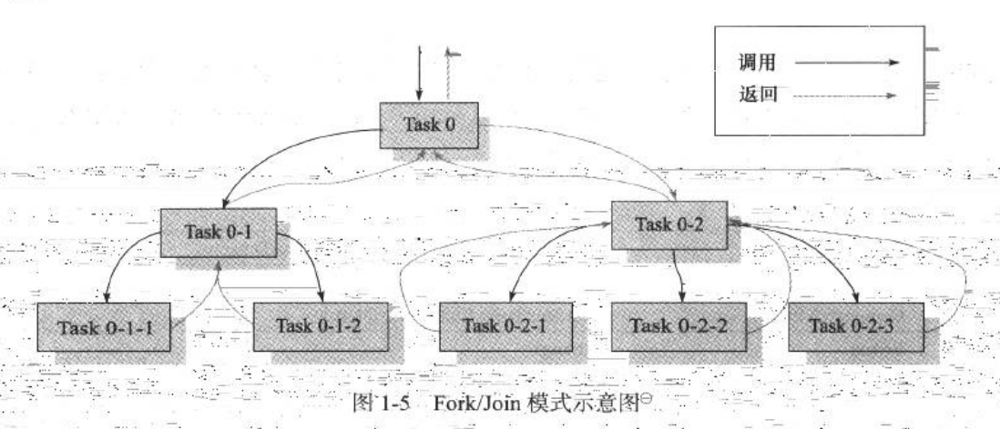
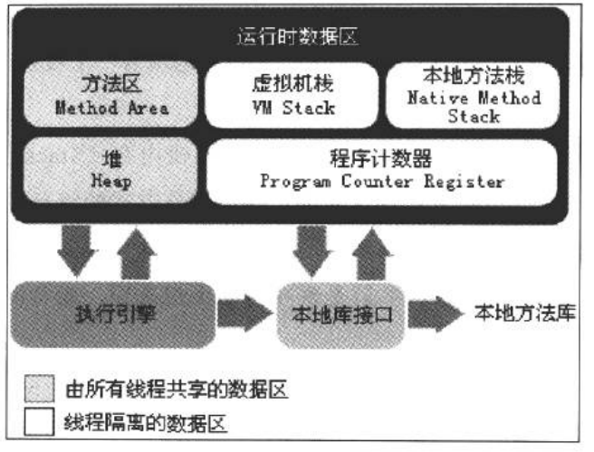

**<u>笔记书籍: 《 深入理解Java虚拟机 》</u>**

### **<u>笔记日期: 2018-06-20一一2018-06-23</u>**

#### Java的优点

> 1. 它摆脱了硬件平台的束缚.   实现了"一次编写,到处运行"的理想
> 2. 它提供了一个相对安全的内存管理和访问机制,避免了绝大部分的内存泄露和指针越界问题
> 3. 它实现了热点代码检测和运行时编译及优化,使得Java应用能够随着运行时间的增加而获得更高的性能.
> 4. 它有一套完善的应用程序接口,还有无数来自商业机构和开源社区的第三方类库来帮助它实现各种各样的功能.  

#### 什么是JDK

>JDK是用于支持Java程序开发的最小环境

#### JDk1.2中发布了什么

>在JDK1.2中,SUN公司把Java体系拆分为了3个方向 : 
>
>1. 面向桌面因公的J2SE
>2. 面向企业级开发的J2EE
>3. 面向手机等移动终端开发的J2ME

#### JDK1.5中发布了什么

> JDK1.5中加入了自动装箱,泛型,动态注解,枚举,可变长参数,便利循环等语法特性

#### Android中的Java虚拟机

>  Android平台的虚拟机是 Dalvik VM,它不是一个Java虚拟机,它并没有遵循Java虚拟机规范,不能直接执行Java的Class文件,同时它使用的是寄存器架构,而不是JVM中常见的栈架构.它执行的dex文件可以通过Class文件转化而来.

#### Java对多核并行的支持

> 在JDK1.5就引进了java.util.concurrent包实现了一个粗粒度的并发框架
>
> 在JDK1.7中加入了java.util.concurrent.forkjoin包

#### OpenJDK

> SUN公司在2006年将OpenJDK开源,OpenJDK和OracleJDK除了在FontRenderer和FlightRecorder之外几乎没有什么差别.

#### 虚拟机运行时数据区

#### 程序计数器

程序计数器可以看做是当前线程所执行的字节码的行号指示器,通过改变这个计数器的值来选取下一条需要执行的字节码指令.

每个线程都有一个独立的程序计数器,各条线程之间的计数器互不影响,独立存储,这类内存区域为"线程私有"的内存

#### 虚拟机栈

虚拟机栈用来执行Java方法,每个线程的栈都是私有的.栈描述的是Java方法执行的**内存模型**:

> 每个方法在执行的同时都会创建一个栈帧用于存储局部变量表,操作数栈,动态链接,方法出口等信息,每一个方法从调用直至执行完成的过程,就对应着一个栈帧在虚拟机中从入栈到出栈的过程.
>
> 其中的局部变量表存放了编译器可知的各种基本数据类型,对象引用和returnAddress.
>
> 局部变量表所需的内存空间咋编译期间完成分配

#### 本地方法栈

本地方法栈为虚拟机使用到的Native方法服务.

#### Java堆

Java堆的唯一目的就是存放对象的实例,几乎所有的对象实例都在这里分配内存.

>  Java虚拟机中的表述是:所有对象实例以及数组都要在堆上分配
>
> 但是随着JIT编译器的发展与逃逸分析技术的逐渐成熟,栈上分配、标量替换优化技术将会导致一些微妙的变化,独有的对象都分配到堆上也渐渐变的不是那么"绝对"了

#### 方法区

方法区是各个线程共享的内存区域,用户存储已被虚拟机加载的类信息,常量,静态变量,即时编译器编译后的代码等数据.

方法区内存回收的目标主要是针对常量池的回收和对类型的卸载.

#### 运行时常量池

运行时常量池是方法区的一部分.Class文件中除了有类的版本,字段,方法,接口等描述信息外,还有一项是**常量池**,用于存放编译期生成的各种字面量和符号引用,这部分内容将在类加载后进入方法区的运行时常量池中存放.

常量池除了保存Class文件中描述的符号引用外,还会把翻译出来的直接引用也存储在运行时的常量池中.

运行期间也可将新的常量放入到池中,用的比较多的就是String类的intern()方法了.

#### 对象的创建

在类加载检查通过后,虚拟机将为新生对象分配内存.

假设虚拟机中的内存是绝对规整的,分配内存就仅仅是把指针向空闲空间那边挪动一段与对象大小相等的距离,这种分配方式成为"指针碰撞".

如果内存不是规整的,那虚拟机必须维护一个列表,记录上哪些内存块是可用的,在分配的时候从列表中找到一块儿足够大的空间划分给对象实例,并更新列表上的记录,这种分配方式被称为"空闲列表".

选择哪种分配方式由Java堆是否规整来决定,而堆是否规整又由GC是否有**<u>压缩整理</u>**功能来决定

#### 并发的情况下怎么给对象分配内存

一种是在分配的时候给分配行为加锁   一种是每个线程在Java堆中预先分配一小块儿内存,称为**<u>本地线程分配缓冲(TLAB)</u>**,哪个线程要分配内存了,就在它自己的TLAB中先分配内存,只有在TLAB用完之后需要重新分配新的TLAB的时候,才需要同步锁定.

#### 内存分配时候的大致逻辑

首先判断这个类是否已经解释和初始化,然后看TLAB够不够,不够移动指针分配去.够的话分配内存,然后判断是否要置为0,再判断是否启用偏向锁来设置对象头信息,最后将对象放入到堆中.

#### 对象的内存布局

对象在内存中存储的布局可以分为3个区域:对象头(Header),实例数据(Instance Data)和对象填充(Padding)

**<u>HotSpot</u>**虚拟机的对象头包括两部分信息

> 1. 第一部分用于存储对象自身的运行时数据 ( 哈希码,GC分代年龄,锁标识状态,线程持有的锁,偏向线程的ID,偏向时间戳等)
> 2. 第二部分是类型指针,类型指针是对象指向它的类元数据的指针,也就是这个指针用来指示这个对象是哪个类的对象.

实例数据部分是对象真正存储的有效信息,是代码中定义的各种字段内容.包括从父类继承下来的和在子类中定义的,这些数据在内存中的顺序受到虚拟机分配策略以及字段在Java中定义顺序的影响.在满足相同宽度( int,long等的长度 )的字段总是分配在一起的前提之下,在父类中的变量会出现在子类之前.

