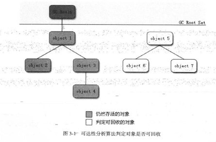
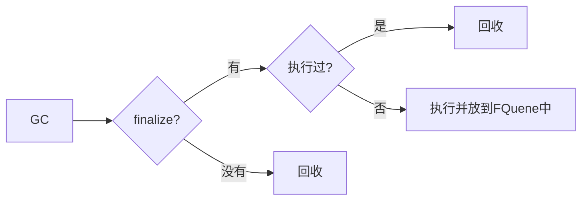

**<u>笔记书籍: 《 深入理解Java虚拟机 》</u>**

### **笔记日期: 2018-06-26一一2018-06-30**

#### 对象的访问定位

由于reference(对象的引用,存放在栈中)类型在虚拟机规范中只规定了它是一个指向对象的引用,并没有定义这个引用应该通过何种方式去定位并访问堆中的对象的位置,所以这部分操作是由虚拟机来实现的,一般来说分为了两种:使用句柄或使用指针两种.

> 1. **使用句柄**时Java堆会在内存中划分出一块儿内存来作为句柄池,reference中存储的就是对象的句柄的地址.而句柄中包含了对象实例数据(堆中)与类型数据(方法区)各自的具体**地址信息**
>
> 2. **使用指针**时,Java堆中就会存放对象的实例数据(堆中)和类型数据(方法区),而指针指向的就是堆中的对象的实例数据了.在对象的实例数据中,包含了指向类型数据的指针.  
>
>    **两者的区别在于使用句柄时,有个句柄池,而使用指针时没有.在使用指针时,对象实例数据中包含了指向对象类型数据的指针,而在使用句柄时,句柄包含了指向实例数据和类型数据的指针,且句柄和实例数据都保存在堆中**
>
>    使用句柄的优势在于修改对象实例时只需要修改句柄中指向的指针就好了,不需要动reference.而使用指针的优势在于访问的速度快,它对比使用句柄少了一次指针的定位过程,但是它如果修改对象实例是需要修改reference中的指向的位置的.
>
>    > 自己的理解:对象的实例数据就是new出来的对象的实际信息,比如说new了一个Student,这个Strudent的name就是对象的实例信息的一部分.而对象的类型数据就是这个Student的class的信息,比如说这个类的类名啊,变量啊..

#### 如何保证一个对象不被GC回收

只需要保证GC Roots到对象之间有可达路径就可以避免垃圾回收机制清除这个对象.

#### 溢出

1. 如果线程请求的深度大于虚拟机所允许的最大深度,将抛出StackOverflowError
2. 如果虚拟机在扩展栈时无法申请到足够的内存空间,则抛出OutOfMemoryError

如果是因为建立过多的线程导致内存溢出,那么在不能够减少线程数或者更换64位虚拟机的情况下,只能通过减少最大堆和减少栈容量来换取更多的线程了.

> 这是因为操作系统分配给虚拟机的大小是一定的.
>
> 要记得每个线程在启动的时候都会创建自己的本地方法栈和虚拟机栈.
>
> 分配给虚拟机的大小-最大堆-方法区=线程可分配的总大小.前面的最大堆和方法区是虚拟机的,这两块儿的大小减小了,那么剩下可以分配给各线程的大小就相应的变大了,所以减少了堆的大小和方法区的大小,可以运行的线程的数量就大大增加了.

#### GC需要完成的3件事情

1. 哪些内存需要回收
2. 什么时候回收
3. 如何回收

#### GC需要关注的是哪些内存

程序计数器+虚拟机栈+本地方法栈随着线程而来,随着线程而灭,所以不需要过多的关注回收问题,随着方法或者线程的结束,内存自然而然就回收了.

Java堆和方法区则不一样,很多接口的实现类只有在程序的运行期间才会知道会创建哪些对象,这部分的内存分配以及回收是动态的,需要垃圾回收机制来关注这部分的回收.

#### 如何判断一个对象已经不能再被使用

##### 引用计数算法

给对象中添加一个引用计数器,每当一个地方引用它是,计数器就+1,当引用失效的时候,计数器就-1.任何时刻计数器为0的对象就是不可使用的.

> 它实现起来比较简单,但是有个致命的缺点,就是无法解决循环引用的问题

##### 可达性分析算法

可达性分析算法就是通过一系列的称为"GC Roots"的对象作为起点,从这些节点开始向下搜索,搜索所走过的路径称为"引用链",当一个对象到GC Roots没有任何的引用链的时候,则表明这个对象是不可用的.下图中5,6,7不可用.

###### 什么对象可以作为GC Roots?

1. 虚拟机栈(栈帧中的本地变量表)中引用的对象.(只要线程没有终止,这些对象就可以使用)
2. 本地方法栈中JNI引用的对象.(同上)
3. 方法区中类静态属性引用的对象.(方法区中的对象不被GC管理,所以这里的对象是存活的)
4. 方法区中常量引用的对象.(3,4中选用的都是静态的对象或者是常量引用的对象,这些是存在于整个生命周期的)

**那为什么选用这几种对象作为GC Roots呢?**

可以概括得出，可作为GC Roots的节点主要在**全局性的引用**与**执行上下文**中。要明确的是，tracing gc必须**以当前存活的对象集为Roots**，因此必须选取确定存活的引用类型对象。GC管理的区域是Java堆，**虚拟机栈**、**方法区**和**本地方法栈**不被GC所管理，因此选用这些区域内引用的对象作为GC Roots，是**不会被GC所回收**的。其中虚拟机栈和本地方法栈都是线程私有的内存区域，只要线程没有终止，就能确保它们中引用的对象的存活。而方法区中类静态属性引用的对象是显然存活的。常量引用的对象在当前可能存活，因此，也可能是GC roots的一部分。

#### 引用类型的扩充

在jdk1.2之前,Java中引用的定义就是如果reference类型的数据中存储着的数值代表的是另一块儿内存的起始地址,就称这块儿内存代表着一个引用.这样引用的定义显得很狭隘,一个对象只能被定义为**有用**或者**没用**.

在jdk1.2之后,java中扩充了这种定义,将引用分为了强引用,软引用,弱引用,虚引用.

> **强引用**:代码中普遍存在的引用就是这种引用.比如说new一个对象就是强引用,只要这种引用还存在,那它引用的对象就不会被回收
>
> **软引用**:软引用用来描述那种有用但是不是必须的引用.如果**内存不够了**,就回收这些引用.使用SoftReference
>
> **弱引用**:弱引用用来描述那种非必须的对象.不管内存够不够,都会被回收掉.使用WeakReference
>
> **虚引用**:这个一般不常用,无法通过这种方式来获得到一个对象实例.但是它可以完成一个功能,它相当于给对象添加了一个通知,在这个对象被回收的时候,这个引用会收到系统发出的一个通知.使用PhantomReference

#### 引用的回收过程

任何一个对象的finalize方法都只会被执行一次

