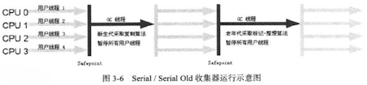
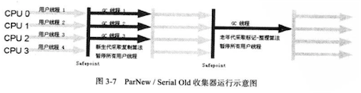
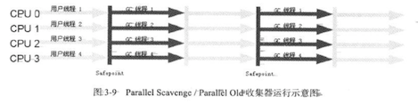
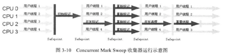
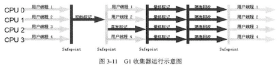

**<u>笔记书籍: 《 深入理解Java虚拟机 》</u>**

### 笔记日期: 2018-07-03一一2018-07-07

#### 如何判断一个类是否是无用的

1. 该类所有的实例都已经被回收,即Java堆中已经不存在该类的任何实例
2. 加载该类的ClassLoader已经被回收
3. 该类对应的Class对象已经没有在任何地方被引用,无法在任何地方通过反射来访问类中的方法

#### 垃圾收集器算法

##### 标记-清除算法

首先标记出所有需要回收的对象,在标记完成后统一回收所有被标记的对象.

> 1. 效率问题:标记和回收的效率都不是很高
> 2. 空间问题:标记清除之后会产生很多不连续的内存碎片,在虚拟机需要分配大对象的时候可能会没有足够的空间阿里分配,不得不提前触发一次垃圾回收.

##### 复制算法

它将可用内存分成了两块儿(A/B),每次使用的只是内存的一半(A),当要执行GC的时候,将A中还存活的对象一次性的复制到B中,然后将A中直接清除就可以了.但是这样的算法太耗费内存的空间了,每次只能使用一半的内存来执行程序.

现代的虚拟机采用的就是复制算法,但是内存的分配略有不同.HotSpot虚拟机默认分为了一块儿Eden和两块儿Survivor空间,其中Eden占了80%,每个Survivor(From+To)占用了10%的空间.使用的时候使用的是一个Eden和一个Survivor空间,在GC的时候会将已经使用的Eden和Survivor空间中还存活的对象复制到另一个没有使用的空间,然后直接清除掉这个Eden空间和Survivor空间就好了.

##### 标记-整理算法

标记整理算法与标记清除在标记的过程是一样的,但是后续步骤不是对对象进行清理,而是让所有的存活对象都向着一端移动,然后直接清除掉边界以外的内存.

##### 分代手机算法

把Java堆分为新生代和老年代.新生代很多对象都是很快创建然后被清除,所以选择复制算法,只需要付出少量的复制代价即可完成收集.而老年代很多对象存活率很高,没有额外的空间对它进行分配担保,所以选择标记-清除或者标记-整理算法.

#### 什么是StopTheWord

就是GC停顿,因为分析工作必须要在一个一致性的快照中进行,不可以出现在分析的过程中对象的引用关系还在不断的变化.所以在GC的时候,需要将整个工作全部暂停了.

#### HotSpot的算法实现

##### GC Roots

使用的是一个称为OopMap的数据结构,在类完成加载的时候,会把对象什么偏移量上是什么类型的数据计算出来了,在JIT编译的过程中也会将栈和寄存器中哪些位置是引用给记录下来.

##### 安全点

安全点是一个特定的地点,程序执行到安全点的时候如果虚拟机 **想要** GC,那么程序就会停在安全点,等待虚拟机GC.安全点的选择标准一般是以程序"**是否具有让程序长时间执行的特征**"来选定的.那么如何在GC发生时让所有的线程都运行到最近的安全点然后开始GC呢?

> 1. 抢先式中断   先让所有的线程全部中断,然后如果有的中断的线程不在安全点上,那么恢复运行到安全点再停下来
> 2. 主动式中断   只是简单的设置一个标志,所有线程执行时主动去轮询这个标志,如果发现标志为true就自己中断挂起,轮询标志的地方和安全点是重合的

##### 安全区域

有的时候现实情况是线程并没有分配到CPU的时间去运行程序,而JVM也不可能会等待,这时候就需要SafeRegion来解决了.

安全区域其实指的是代码中的一部分代码,在这一部分代码中,对象的引用关系不会发生变化.

线程执行到SafeRegion开始的位置的时候,会标记自己已经进入,但是运行到SafeRegion结尾的时候,会去检查系统是否已经完成了根节点枚举/GC,如果完成了才可以继续执行SafeRegion之外的代码,否则需要等待根节点枚举/GC的完成.

#### 垃圾回收器

##### Serial收集器/Serial Old收集器

Serial是最基本的历史最悠久的收集器,这个收集器是一个单线程的收集器,它只会使用一个CPU或一条收集线程去完成垃圾的收集工作,更重要的是它在进行垃圾收集时,必须暂停其他所有的工作线程,直到它完成垃圾的收集工作为止."StopTheWorld"就是对这个的说明.虽然说起来它因为会StopTheWorld而显得"老而无用",但是它依然是虚拟机运行在Client模式下的默认新生代收集器.因为它的简单高效,对于在**单CPU**的模式下,它由于没有线程之间交互的开销,所以效率可以很高,而且只要不是频繁的发生收集,那么这点停顿完全是可以接受的.



##### ParNew收集器

相对于Serial收集器来说,只是收集线程变成了多线程的



##### Parallel Scavenge收集器 / Parallel Old收集器

Parallel Scavenge收集器关注于吞吐量(Throughput)

> 吞吐量 = 运行用户代码的时间 / (运行用户代码的时间 + 垃圾收集的时间)
>
> 假设垃圾收集花费1分钟,运行代码时间为99分钟,那么吞吐量就是99%

收集器可以通过设置一个 ```-XX:+UseAdaptiveSizePolicy ``` 参数来开启自动调优,它会动态调节参数来提供最合适的停顿时间或者最大的吞吐量,这种调节方式称为`GC自适应调节策略`.

也可以通过`-XX:GCTimeRatio`和`-XX:MaxGCPauseMillis`参数来控制吞吐量大小以及最大垃圾回收时间.但是要注意的是设置MaxGCPauseMillis是通过牺牲吞吐量和新生代空间来换取的回收时间的减小(将新生代空间从500M缩小到100M,收集时间肯定是减小了的,但是收集的次数也会变得很频繁,那么吞吐量就变小了).



##### CMS收集器

CMS收集器是一种以**获取最短回收停顿时间**为目标的收集器.

CMS收集器基于**标记-清除算法**来实现的,它的整个过程分为了4个部分:

> 1. 初始标记 (仅仅只是标记一下GC Roots能够直接关联到的对象,速度很快)
> 2. 并发标记 (就是顺着GC Roots进行跟踪的阶段)
> 3. 重新标记 (**修正**并发标记期间**因**用户程序**运行**而导致**标记**产生**变动**的那一部分对象的标记**记录**)
> 4. 并发清除

从耗时上来看 并发标记 > 重新标记 > 初始标记



但是这个收集器有三个缺点:

1. 对CPU资源非常敏感

敏感是由它的策略导致的,它默认会启动的线程数量是 `(CPU数+3)/4`个,当CPU的个数为4个以及个以上时,占用了不少于25%的资源,但是如果CPU的个数不足4个,比如说2个,那么占用的就很大了.所以用户这时就会感觉到比较卡.

1. 需要在资源不够之前就提前进行清理

因为在清理的时候用户线程还在运行着,所以清理的时候就需要预留一些空间给还在运行着的线程来使用.

这些还在运行的程序产生的垃圾称为浮动垃圾,因为这些垃圾产生在标记之后产生,只能等待下一次去清理了.

1. 因为它使用的是标记-清除算法,所以清除之后内存中会有很多空间碎片产生.

因为这些空间碎片的产生,所以会很容易出现内存很大,但是无法给当前的大对象分配空间的事情,不得不进行一次FullGC.

##### G1收集器

G1是一款面向服务端应用的垃圾收集器,它的特点如下:

1. 并行与并发( 充分利用多核--并行,GC与程序一起运行--并发 )
2. 分代收集
3. 空间整合 ( G1从整体上来看是基于"标记-整理"算法,但是在两个Region之间来看是基于复制算法来实现的 )
4. 可预测的停顿 

G1将内存划分为了几个相同大小的独立区域(Region),虽然还有新生代和老年代的概念,但是不再是物理隔离的了,它们都是一部分Region(不需要连续)的集合.

它之所以可预测停顿,是因为它可以有计划的避免在整个Java堆中进行全区域的垃圾收集.G1收集器跟踪各个Region里面的垃圾堆积的价值大小(回收到的空间以及回收需要的时间),后台维护一个优先列表,每次根据允许的收集时间,优先回收价值最大的Region(所以称为Garbage-First)

Region之间的对象引用是通过 Remembered Set 来避免全堆扫描的.每个Region都对应有一个Remembered Set,当这个Region(A)中的对象被其他Region(B)中的引用的时候,会在被引用的对象(A)所在的Region中的Remembered Set中记录引用的信息.

##### G1的运作步骤

1. 初始标记 (标记GCRoots可以直接关联到的对象,修改TAMS的值,停顿线程但很短)
2. 并发标记 (可达性分析)
3. 最终标记 (用户线程产生的新的变化记录到RememberedSetLogs,最后和RememberedSet进行合并)
4. 筛选回收



```
1、初始标记（initial marking）：暂停阶段。扫描根集合，标记所有从根集合可直接到达的对象并将它们的字段压入扫描栈（marking stack）中等到后续扫描。G1使用外部的bitmap来记录mark信息，而不使用对象头的mark word里的mark bit。在分代式G1模式中，初始标记阶段借用young GC的暂停，因而没有额外的、单独的暂停阶段。 
2、并发标记（concurrent marking）：并发阶段。不断从扫描栈取出引用递归扫描整个堆里的对象图。每扫描到一个对象就会对其标记，并将其字段压入扫描栈。重复扫描过程直到扫描栈清空。过程中还会扫描SATB write barrier所记录下的引用。 
3、最终标记（final marking，在实现中也叫remarking）：暂停阶段。在完成并发标记后，每个Java线程还会有一些剩下的SATB write barrier记录的引用尚未处理。这个阶段就负责把剩下的引用处理完。同时这个阶段也进行弱引用处理（reference processing）。 
注意这个暂停与CMS的remark有一个本质上的区别，那就是这个暂停只需要扫描SATB buffer，而CMS的remark需要重新扫描mod-union table里的dirty card外加整个根集合，而此时整个young gen（不管对象死活）都会被当作根集合的一部分，因而CMS remark有可能会非常慢。 
4、清理（cleanup）：暂停阶段。清点和重置标记状态。这个阶段有点像mark-sweep中的sweep阶段，不过不是在堆上sweep实际对象，而是在marking bitmap里统计每个region被标记为活的对象有多少。这个阶段如果发现完全没有活对象的region就会将其整体回收到可分配region列表中。
```

来源:[http://hllvm.group.iteye.com/group/topic/44381#post-272188](http://hllvm.group.iteye.com/group/topic/44381#post-272188)

